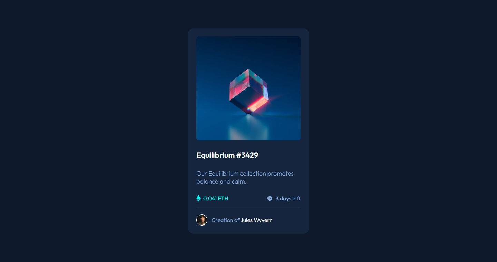

# Frontend Mentor - NFT preview card component solution

This is a solution to the [NFT preview card component challenge on Frontend Mentor](https://www.frontendmentor.io/challenges/nft-preview-card-component-SbdUL_w0U). Frontend Mentor challenges help you improve your coding skills by building realistic projects. 

## Table of contents

- [Overview](#overview)
  - [The challenge](#the-challenge)
  - [Screenshot](#screenshot)
  - [Links](#links)
- [My process](#my-process)
  - [Built with](#built-with)
  - [What I learned](#what-i-learned)
  - [Continued development](#continued-development)
  - [Useful resources](#useful-resources)
- [Author](#author)
- [Acknowledgments](#acknowledgments)

**Note: Delete this note and update the table of contents based on what sections you keep.**

## Overview

### The challenge

Users should be able to:

- View the optimal layout depending on their device's screen size
- See hover states for interactive elements

### Screenshot

### Links

- Solution URL: [Solution](https://your-solution-url.com)
- Live Site URL: [Live](https://your-live-site-url.com)

## My process

### Built with

- Semantic HTML5 markup
- CSS custom properties
- Flexbox
- [React](https://reactjs.org/) - JS library

### What I learned

For this exercice I did not learn much, but I builded some react muscle memory since I'm just a beginner in react.

### Continued development

I'm not really confident about my CSS skills yet, this is something that I want to improve in the future. I'm getting the hang of React, starting to get faster at writing components and I'm learning new things. I'm also learning new things about the frontend development process, like defining components and writing them.

### Useful resources

- [Scrimba](https://www.scrimba.com) - This helped me start my FrontEnd development path. I really like the way they teach.

## Author

- Website - [Carlos Gabriel Silva Stedile](https://www.your-site.com)
- Frontend Mentor - [@Senatauro](https://www.frontendmentor.io/profile/yourusername)

## Acknowledgments

I want to thanks the Frontend Mentor team for creating a awesome site full of challenges and resources for new and experienced developers to keep learning and becoming better!